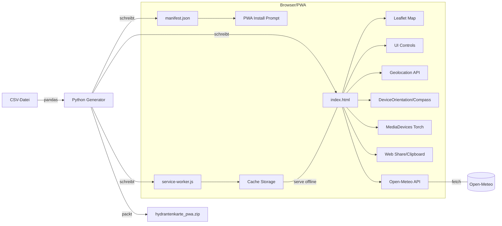
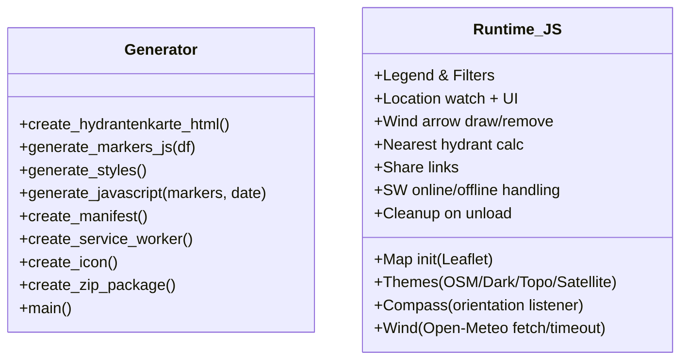
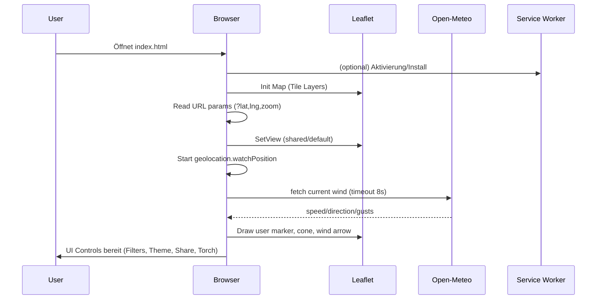
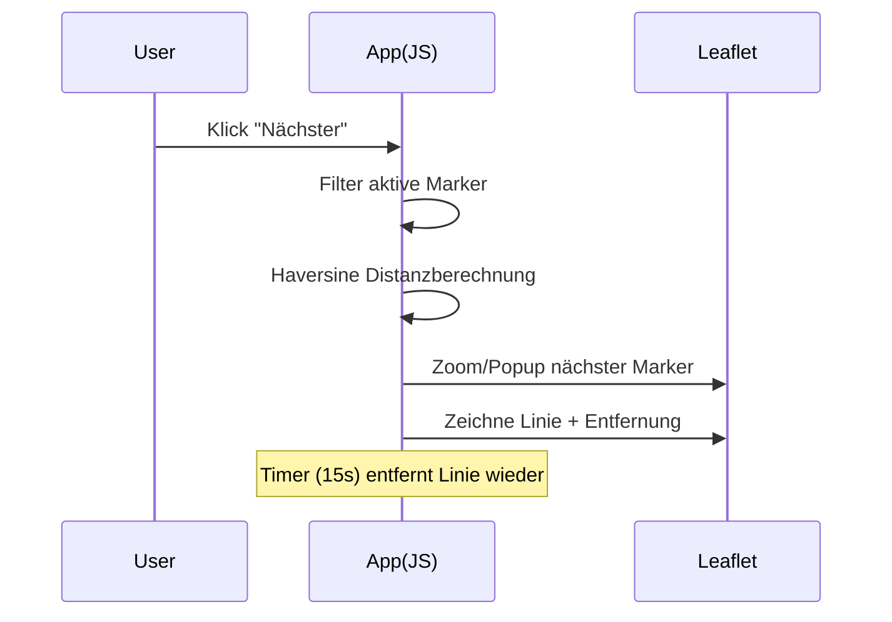
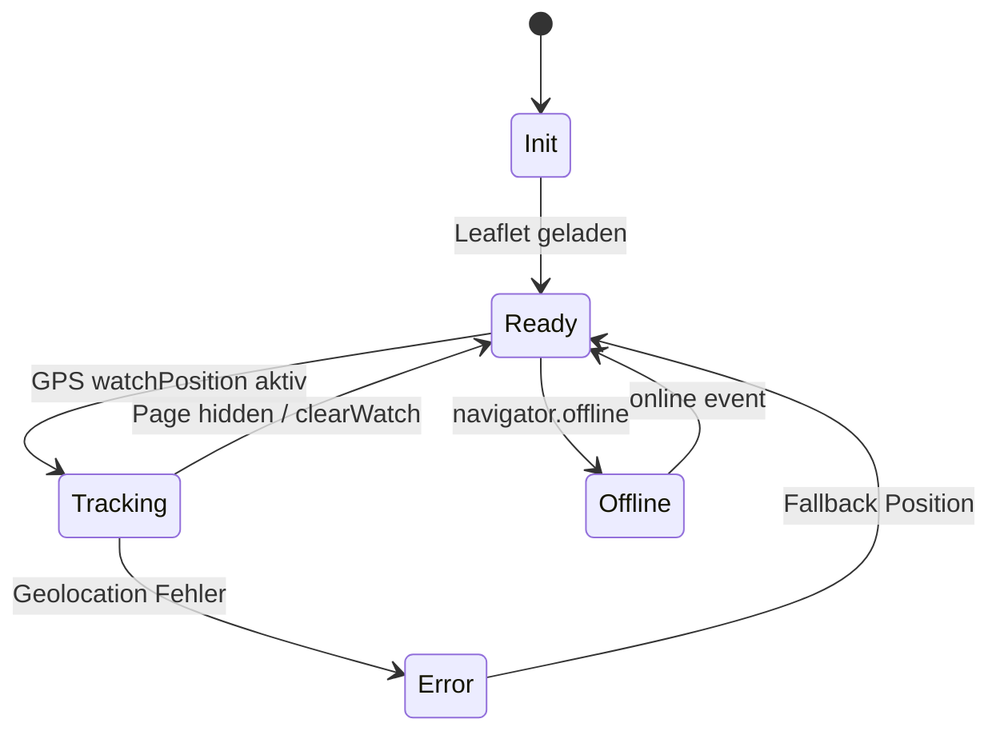

# 🚒 Hydrantenkarte Generator – Einsatzoptimierte Version 2.4

Generiert eine vollständige, offlinefähige **PWA**-Karte (Leaflet) für Feuerwehr-Hydranten inklusive **GPS-Tracking**, **Kompass**, **Windpfeil** (Open-Meteo), **Filter/Legende**, **Taschenlampe (3 Modi)**, **Teilen-Funktion**, **Themenwechsel**, sowie **Service Worker** & **Manifest**.

> **Kurz:** Aus einer CSV wird eine einsatzfertige `index.html` mit allem Drum und Dran gebaut – inkl. Icons/Assets ins ZIP gepackt.

---

## Inhaltsverzeichnis

- [Funktionen](#funktionen)
- [Systemvoraussetzungen](#systemvoraussetzungen)
- [Ordnerstruktur](#ordnerstruktur)
- [CSV-Format](#csv-format)
- [Installation & Nutzung](#installation--nutzung)
- [Konfiguration](#konfiguration)
- [Build-Artefakte](#build-artefakte)
- [Browserrechte & PWA](#browserrechte--pwa)
- [Architektur](#architektur)
- [Abläufe (Sequenzdiagramme)](#abläufe-sequenzdiagramme)
- [Zustände & Fehlerbehandlung](#zustände--fehlerbehandlung)
- [Tipps & Troubleshooting](#tipps--troubleshooting)
- [Sicherheit & Datenschutz](#sicherheit--datenschutz)
- [Performance-Hinweise](#performance-hinweise)
- [Kompatibilität](#kompatibilität)
- [Changelog](#changelog)
- [Beitragen](#beitragen)
- [Lizenz](#lizenz)

---

## Funktionen

- 🗺️ **Leaflet-Karte** mit 4 Themes: Standard, Dunkel, Topo, Satellit  
- 📍 **GPS-Tracking** mit Genauigkeitskreis und Höhenanzeige (sofern verfügbar)  
- 🧭 **Kompass** mit Himmelsrichtungen (iOS/Android/Web – mit Permission-Flow)  
- 💨 **Windpfeil** (dezent, gestrichelt) & **Winddaten** via **Open-Meteo**  
- 🔦 **Taschenlampe** (Aus → Ein → Blink) via `torch`-Capability der Kamera  
- 🧪 **Hydranten-Filter** (Über-/Unterflur, Rettungspunkt, Wasserbehälter, Sperrpunkt)  
- 🔎 **Nächster Hydrant** (Linie & Entfernung, Auto-Remove)  
- 📤 **Teilen-Funktion**: eigener Kartenlink + Google/Apple Maps  
- 📴 **Offline-fähig** via **Service Worker** und **Cache-Versionierung**  
- 🧰 **Robuste Fehlerbehandlung** (Errors/Promise-Rejections, Timeouts)  
- 🧽 **Memory-Leak-Prävention** (Cleanup auf `beforeunload`)  
- 📱 **Responsive UI** inkl. Mobile-Optimierungen

---

## Systemvoraussetzungen

- **Python 3.8+**
- **Pip-Pakete**: `pandas`
- Dateisystemzugriff (zum Schreiben von `index.html`, `manifest.json`, `service-worker.js`, ZIP)
- **Internet** (zur Laufzeit der PWA für Open-Meteo; danach optional offline)

---

## Ordnerstruktur

```text
Hydrantenkarte_Ferstl/
├─ Hydrantenkarte_FF_Hamberg_20250422.csv    # Eingabedaten (CSV, Semikolon-getrennt)
├─ icons/
│  ├─ red-dot.png
│  ├─ blue-dot.png
│  ├─ green-dot.png
│  ├─ yellow-dot.png
│  └─ purple-dot.png
├─ icon.png                                  # PWA-App-Icon (192x192, maskable)
├─ index.html                                # (vom Skript generiert)
├─ manifest.json                             # (vom Skript generiert)
├─ service-worker.js                         # (vom Skript generiert)
└─ hydrantenkarte_pwa.zip                    # (vom Skript generiert)
```

---

## CSV-Format

**Trennzeichen:** `;` (Semikolon)

**Pflichtspalten**
- `Latitude` (z. B. `49.10951`)
- `Longitude` (z. B. `11.68453`)
- `Type` (Kleinschreibung empfohlen im Code-Flow; wird intern `lower()` verarbeitet)  
  Gültige Typen (Icon-Mapping):
  - `überflurhydrant` → `icons/red-dot.png`
  - `unterflurhydrant` → `icons/blue-dot.png`
  - `rettungspunkt` → `icons/green-dot.png`
  - `wasserbehälter` → `icons/yellow-dot.png`
  - `sperrpunkt` → `icons/purple-dot.png`

**Optionale Spalten**
- `Description` (Popup-Beschreibung)
- `Size` (Nenndurchmesser DN in mm)
- `Department` (weitere Infozeile)

**Beispiel**

```csv
Latitude;Longitude;Type;Description;Size;Department
49.11001;11.68501;überflurhydrant;Hydrant Hauptstraße;80;FF Hamberg
49.10877;11.68322;unterflurhydrant;Hydrant Dorfplatz;100;FF Hamberg
49.11221;11.68013;rettungspunkt;Rettungspunkt RP-03;;Landkreis
```

---

## Installation & Nutzung

1. **Repository klonen** (oder Code speichern)
2. **Konfiguration prüfen/anpassen** (siehe [Konfiguration](#konfiguration))
3. **Python-Umgebung vorbereiten**
   ```bash
   python -m venv .venv
   .venv\Scripts\activate      # Windows
   # source .venv/bin/activate # macOS/Linux
   pip install pandas
   ```
4. **Skript ausführen**
   ```bash
   python your_script_name.py
   ```
5. **Ergebnis öffnen**
   - `index.html` im Browser öffnen
   - Optional: als **PWA installieren**

---

## Konfiguration

Im Skriptkopf:

```python
base_dir = r"C:\Users\sebas\Downloads\Hydrantenkarte_Ferstl"
csv_path = os.path.join(base_dir, "Hydrantenkarte_FF_Hamberg_20250422.csv")
output_html_path = os.path.join(base_dir, "index.html")
output_zip = os.path.join(base_dir, "hydrantenkarte_pwa.zip")
```

- **`base_dir`**: Arbeitsverzeichnis mit CSV/Icons
- **`csv_path`**: Pfad zur CSV (Semikolon-getrennt)
- **`output_html_path`**: Ziel-HTML
- **`output_zip`**: Ziel-ZIP

**Hinweis:** Das Skript erzeugt zusätzlich `manifest.json` und `service-worker.js` im `base_dir`.

---

## Build-Artefakte

- `index.html` – komplette Anwendung (Leaflet, UI, JS, CSS)
- `manifest.json` – PWA-Manifest (Name, Icons, Theme)
- `service-worker.js` – Offline-Cache (`CACHE_NAME = 'hydrantenkarte-v7.4'`)
- `hydrantenkarte_pwa.zip` – Paket mit obigen Dateien und Icons (falls vorhanden)

---

## Browserrechte & PWA

- **GPS**: Standortfreigabe erforderlich (`navigator.geolocation`)
- **Kompass**: `DeviceOrientationEvent` (iOS: Permission-Prompt via `requestPermission()`)
- **Taschenlampe**: Kamera-Zugriff + `torch` Capability (nicht auf allen Geräten verfügbar)
- **Sharing**: `navigator.share` (Fallback: Kopieren in Zwischenablage)
- **Offline**: Service Worker cached Ressourcen (Leaflet-Assets via CDN werden ebenfalls gecached)

---

## Architektur

### Komponentenübersicht



### Modulstruktur (High-Level)



---

## Abläufe (Sequenzdiagramme)

### App-Start & Initialisierung



### Nächster Hydrant



---

## Zustände & Fehlerbehandlung



- **Globales Error-Handling**
  - `window.error` & `unhandledrejection`: Loggen, App läuft weiter
- **Open-Meteo**
  - Timeout (8 s) mit `AbortController`, Retry bei `force` nach 30 s
- **Cleanup**
  - `beforeunload`: `clearWatch`, Torch-Tracks stoppen, Intervals/Capture lösen

---

## Tipps & Troubleshooting

- **CSV wird nicht gefunden** → `csv_path` prüfen
- **Keine Marker** → CSV-Spaltennamen & `;` als Delimiter prüfen
- **Torch funktioniert nicht** → Gerät/Browser unterstützt `torch` evtl. nicht
- **Kompass tut nichts** → Permission-Prompt bestätigen (iOS), Gerät mit Sensor
- **Winddaten leer** → Internetverbindung/Firewall/Timeout prüfen
- **Offline** → Erstes Laden online (Assets cachen), danach funktioniert offline

---

## Sicherheit & Datenschutz

- Standort/Kompass/Kamera werden **nur lokal im Browser** genutzt.  
- Es werden **keine** personenbezogenen Daten gespeichert.  
- Externe Requests: **Open-Meteo** (anonym, Koordinaten-basiert für Wetter).  
- Prüfen Sie interne Richtlinien, falls Einsatzdaten sensibel sind.

---

## Performance-Hinweise

- Markeranzahl: Bei sehr großen CSVs Clustering in Betracht ziehen (Leaflet.markercluster)
- Tile-Layer: CDN-Antwortzeiten beachten; eigene Tileserver bringen Stabilität
- Cache-Versionierung: `CACHE_NAME` bei relevanten Änderungen erhöhen
- Reduzierte Repaints: UI-Elemente sind minimalistisch, CSS ist kompakt

---

## Kompatibilität

- **Desktop**: Chrome, Edge, Firefox, Safari (aktuelle Versionen)
- **Mobil**: Android Chrome/Edge; iOS Safari (mit Compass-Permission)
- **Torch**: nur auf Geräten mit Kamera-`torch`-Capability

---

## Changelog

### v2.4
- Sofortige Karten-Initialisierung nach Leaflet-Load
- **Windpfeil komplett überarbeitet** (dezent, gestrichelt, Länge ~ Stärke, korrekte Richtung)
- Getrennte Entfernung von Linie **und** Pfeilspitze
- Taschenlampe mit **3 Modi** (Aus/Ein/Blink)
- **Teilen-Funktion**: eigener Kartenlink + Google/Apple
- Timeout/Retry für Open-Meteo
- Cleanup & Memory-Leak-Prevention
- Verbesserte Responsive-Styles & Mobile-Optimierungen
- ZIP-Packaging inkl. Icons

---

## Beitragen

1. Forken & Feature-Branch erstellen
2. Änderungen committen (prägnante Commit-Nachrichten)
3. PR erstellen (Beschreibung, Screens, ggf. CSV-Beispiel anonymisiert)
4. Code-Review abwarten

**Ideen:** Marker-Clustering, Offline-CSV-Cache, Editiermodus, Export/GPX, Einsatzprotokoll-Links.

---

## Lizenz

Dieses Projekt kann intern in Feuerwehren/Organisationen genutzt und angepasst werden.  
Bitte ggf. eigene Lizenz-/Nutzungsbedingungen ergänzen.
